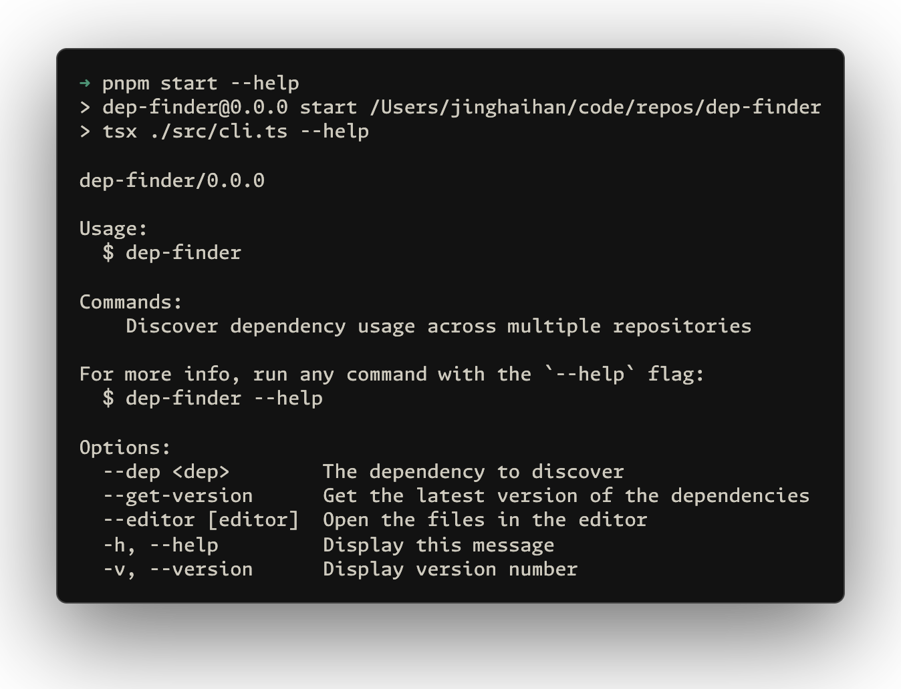

# dep-finder

[![npm version][npm-version-src]][npm-version-href]
[![bundle][bundle-src]][bundle-href]
[![JSDocs][jsdocs-src]][jsdocs-href]
[![License][license-src]][license-href]

A CLI tool for discovering dependency usage across multiple repositories. Quickly find all `package.json` and `pnpm-workspace.yaml` files that reference specific dependencies, making it easy to manage and upgrade packages across your entire project ecosystem.

## Usage

## Why ?

When managing multiple repositories under a single directory, synchronizing dependency updates (such as upgrades) becomes a repetitive task. You need an efficient way to scan and locate all `package.json` and `pnpm-workspace.yaml` files that use a specific dependency. `dep-finder` solves this problem by automatically discovering all occurrences of your target dependencies, and optionally opening them in your editor for batch modifications.

## License

[MIT](./LICENSE) License © [jinghaihan](https://github.com/jinghaihan)

<!-- Badges -->

[npm-version-src]: https://img.shields.io/npm/v/dep-finder?style=flat&colorA=080f12&colorB=1fa669
[npm-version-href]: https://npmjs.com/package/dep-finder
[npm-downloads-src]: https://img.shields.io/npm/dm/dep-finder?style=flat&colorA=080f12&colorB=1fa669
[npm-downloads-href]: https://npmjs.com/package/dep-finder
[bundle-src]: https://img.shields.io/bundlephobia/minzip/dep-finder?style=flat&colorA=080f12&colorB=1fa669&label=minzip
[bundle-href]: https://bundlephobia.com/result?p=dep-finder
[license-src]: https://img.shields.io/badge/license-MIT-blue.svg?style=flat&colorA=080f12&colorB=1fa669
[license-href]: https://github.com/jinghaihan/dep-finder/LICENSE
[jsdocs-src]: https://img.shields.io/badge/jsdocs-reference-080f12?style=flat&colorA=080f12&colorB=1fa669
[jsdocs-href]: https://www.jsdocs.io/package/dep-finder
